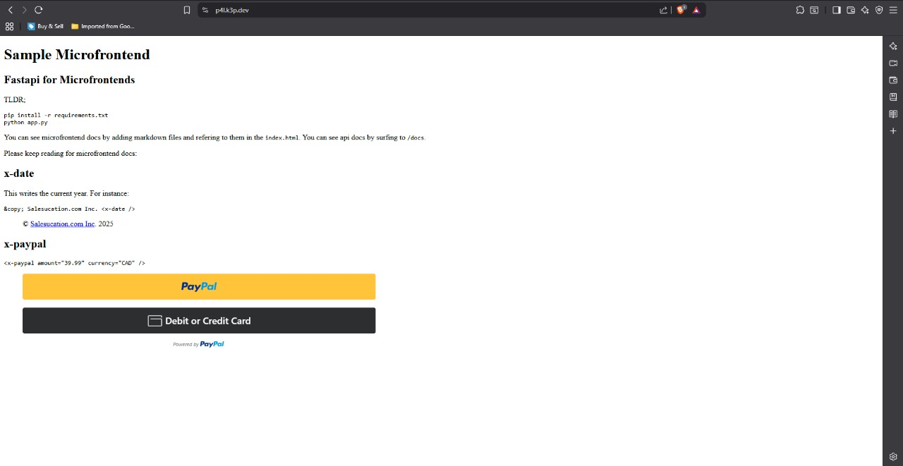
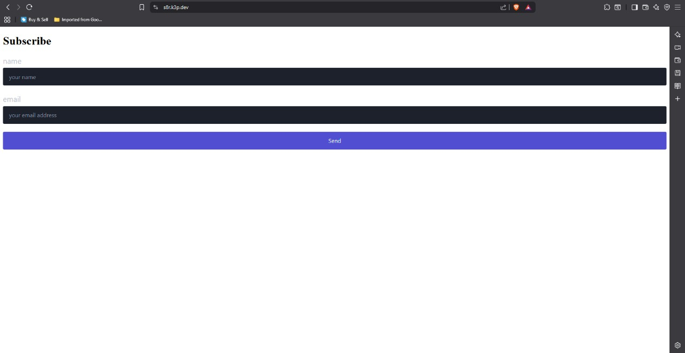
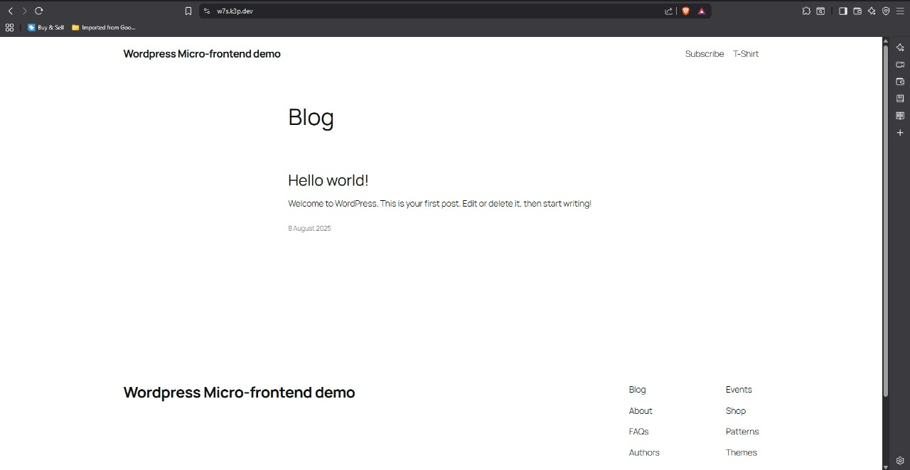
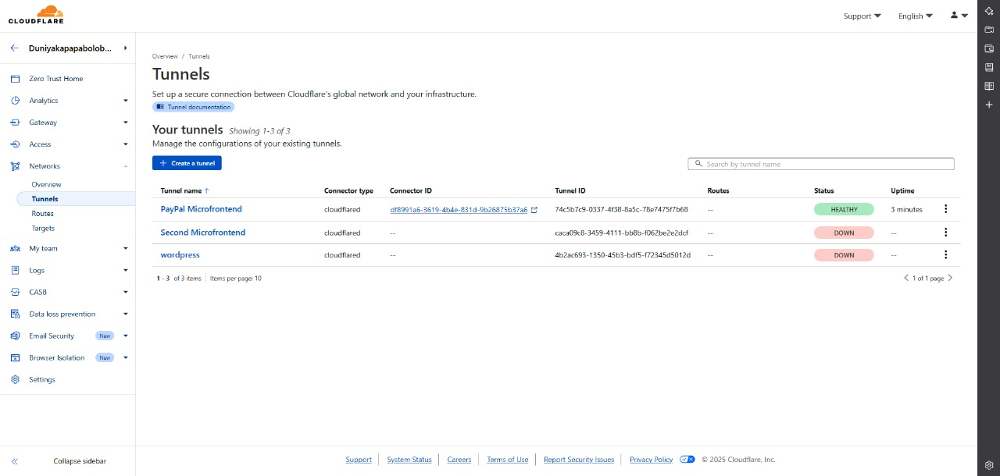
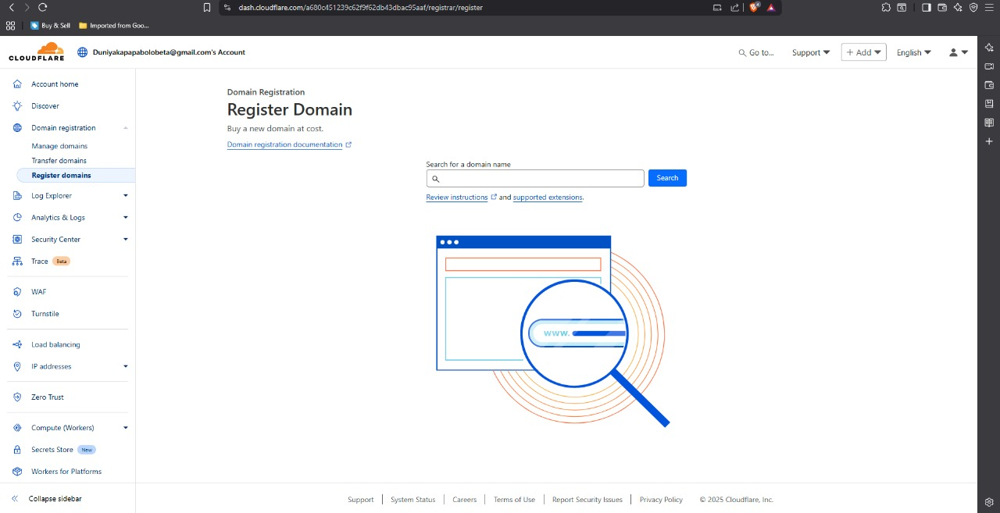
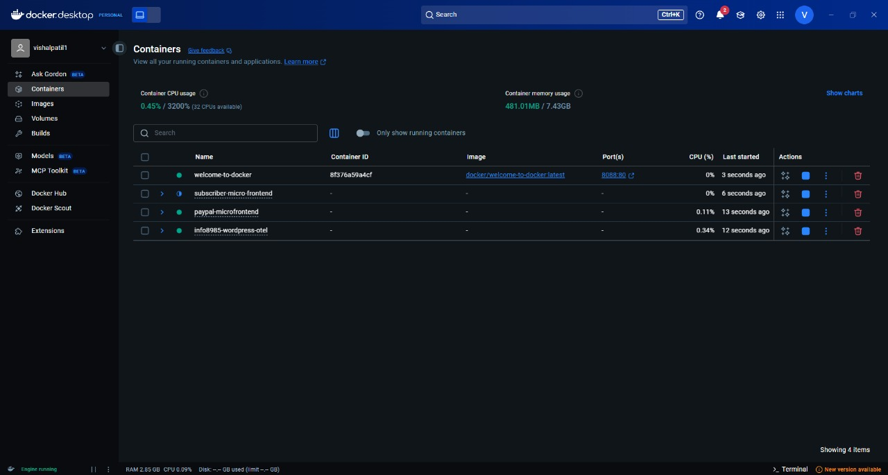

# Micro‑frontends Demo — Screenshots

Below are the task screenshots with a one‑line note on what each shows.

---

### 1) FastAPI micro‑frontend demo

*One line:* FastAPI micro‑frontend landing page with custom tags `x-date` and `x-paypal` rendering PayPal buttons.

---

### 2) Subscriber micro‑frontend

*One line:* Subscriber micro‑frontend UI — name/email form with a **Send** action.

---

### 3) WordPress micro‑frontend

*One line:* WordPress micro‑frontend demo — blog home page.

---

### 4) Cloudflare Zero Trust — Tunnels

*One line:* Cloudflare Tunnels dashboard — PayPal tunnel **Healthy**, others **Down**.

---

### 5) Cloudflare Registrar — Register Domain

*One line:* Cloudflare Registrar **Register Domain** screen.

---

### 6) Docker Desktop — Containers

*One line:* Docker Desktop showing containers for subscriber, PayPal micro‑frontends, and WordPress stack.
